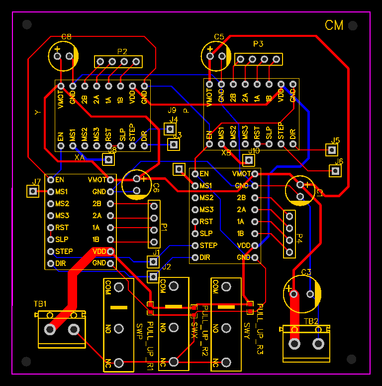

# Mosuniq - The Mosaic Robot

The purpose of my project was to automate the process of creating mosaics by developing a software tool that can process images into a mosaic image and then designing and building a machine that is capable of picking and placing tiles to recreate it. This  project involved different disciplines, like informatics, statistics, mechanics, electronics and control system.
I developed a library in Python of an optimized clustering algorithm to process the image and designed an efficient and cost-effective mechanical system in Solidworks. The project also included the electrical design, schematics and PCBs for the control of mechanical components.

## General Framework
The customer uploads an image and the process automatically starts: the image is processed in Python, using machine learning algorithms to analyze the image and to select the best matching colors from the available tile set. The processed image, represented as a string of colors is then passed through serial comunication to Arduino, which dictates the movement of the mechanical system and the positioning of the tiles on a self-adhesive mesh of 50x50 cm. The mosaic is then ready to be trasported and it will be then installed on site, putting fresh tile grout on it.

## Image Processing
I start by importing the input image into my program using OpenCV. Next, I preprocess the image using Gaussian filtering to reduce noise and smooth out any irregularities. I experiment with different kernel sizes and sigma values to find the optimal values for my specific input image.

Then, I apply the k-means clustering algorithm to identify the dominant colors in the image. I experiment with different values of k, the number of clusters, using methods such as the elbow method and silhouette analysis to determine the optimal value for my specific image. 

From the k-means clustering algorithm, I obtain the optimal colors for the mosaic image. Then, I manually selected a set of colors that could be found on a tile shop online, and created a database of these colors for use in the next step.

Using the database of available colors, I recreate the mosaic image again, this time using only the available colors. This is done by replacing each pixel in the original image with the closest color from the database. 

Finally, I create a sequence of the colors that I pass to the robot for picking and placing to recreate the image. This sequence is created by iterating through each pixel in the mosaic image and finding the corresponding color in the database of available colors. The resulting sequence is then used to guide the robot in creating the final mosaic image.

  
  

## Mechanical Design

The principle that guided the design was the pick and place system. This required me to handle many mechanical components that are highly used in these applications such as actuators, stepper motors, pneumatic cylinders, solenoid valves, vacuum systems, among others.

To improve the mechanical design skills, I drew each component from scratch in Solidworks. With this tool, I was able to visualize all the parts, make changes and test their effectiveness before manufacturing the assembly.

  
  

## Electrical Design
Finally, to ensure a well-performing and reliable system I designed the Printed Circuit Boards (PCBs). I also soldered the board

  
  

## Control of machine
To control the machine I connected it with ArduinoMega and I programmed it in C++. At the beginning, ArduinoMega communicate to Python trough serial comunication. This is necessary to use the image processing performed in Python to guide the machine in the recreation of the mosaic. At each iteration, the mosaic machine requests to Pyhton the next color that has to be picked.

  
  

